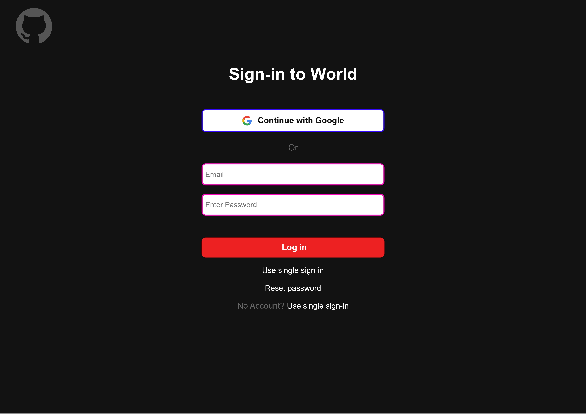

# Sign-in page

- This Repository for the Sign-in of the webpage.
- It mainly consists of the Header,Main content and footer.
- In header section there is one logo of img element.
- In main content there is a element of form,input,placeholders and one log in button
- In footer there is some links with new login and reset password.
***
# To preview

# Click function

- When users click the continue with google.There has a Error will notify.
 
# To Preview here

